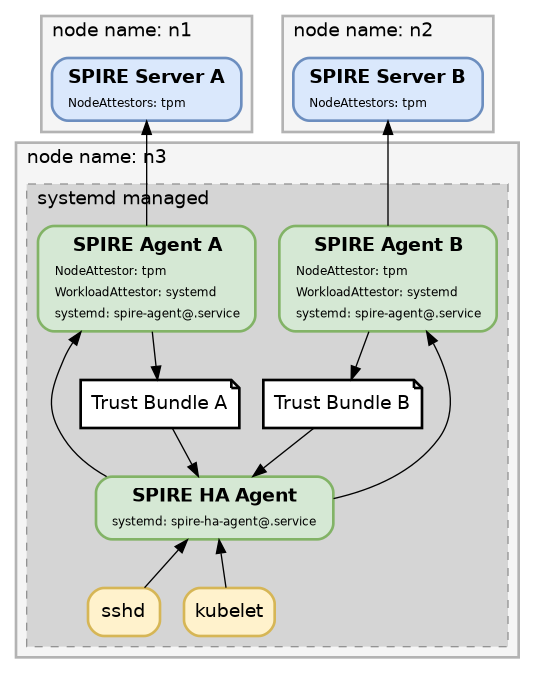
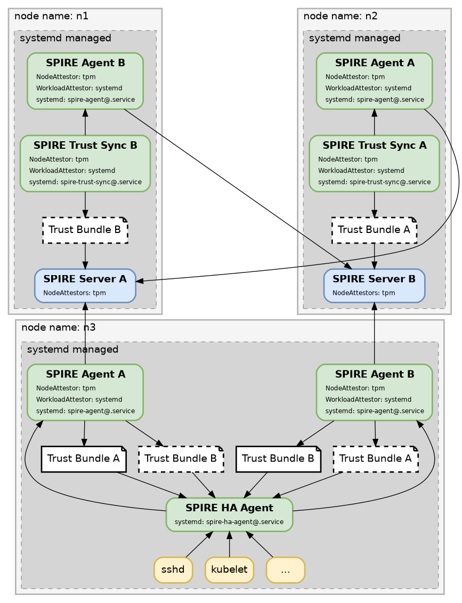

# SPIRE HA Agent

An agent to setup a SPIRE HA TrustDomain using two independent SPIRE Servers

## Warning

This code is very early in development and is very experimental. Please do not use it in production yet. Please do consider testing it out, provide feedback,
and maybe provide fixes.

## Simple Diagram

## Cross Linked Trust Diagram

## How it Works

If the trust bundles of both servers are presented to the workload, it will not care which server instance a certificate is issued from. This agent provides
both trust bundles to the end user as one trust bundle, and will contact whichever server is responding to respond to x509 certificate or jwt token requests.
