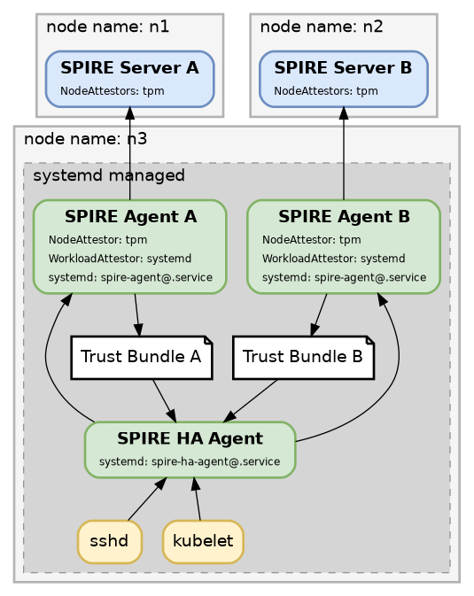
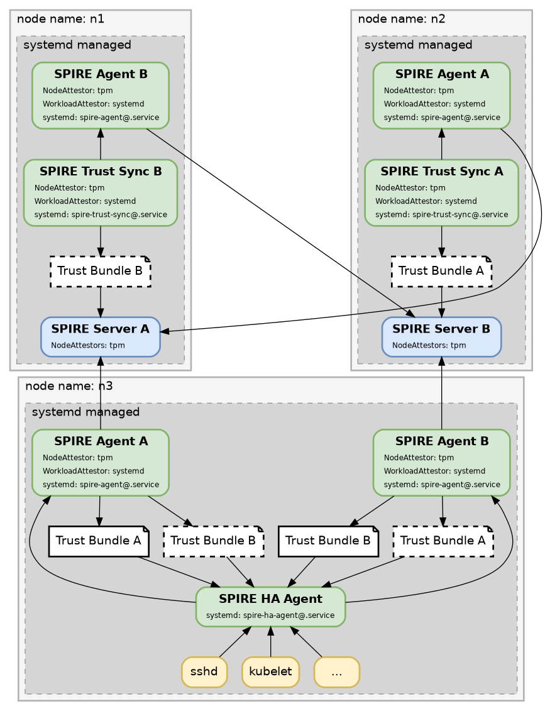

# SPIRE HA Agent

An agent to setup a SPIRE HA TrustDomain using two independent SPIRE Servers

## Warning

This code is very early in development and is very experimental. Please do not use it in production yet. Please do consider testing it out, provide feedback,
and maybe provide fixes.

## How it Works

If the trust bundles of both servers are presented to the workload, it will not care which server instance a certificate is issued from. This agent provides
both trust bundles to the end user as one trust bundle, and will contact whichever server is responding to respond to x509 certificate or JWT token requests.

# Basic Setup

## Simple Diagram

# Advanced setup

While the basic setup allows a server to go down and workloads to continue to operate normally, it has a drawback. It requires both servers to be up during spire-ha-agent startup. This restriction can be eliminated by making the trust bundle of the other server available. The spire-trust-sync service can be used to do so.

# Modes

The agent supports two upstream API modes, selected with the `-mode` flag:

- `-mode=delegated` (default): uses the SPIRE Delegated Identity API over each agent's private admin socket. This is the original behavior.
- `-mode=broker`: uses the experimental SPIFFE Broker API. The connection is authenticated with mTLS using an X509-SVID the spire-ha-agent obtains from each SPIRE agent's Workload API, and trust bundles (including federated bundles) are delivered inline in the broker responses. Unlike delegated mode, broker mode supports federation: trust domains listed in the spire-ha-agent entry's `federates_with` (other than `spire-ha`) are served to workloads as federated bundles, unioned across both brokers.

## Broker mode configuration

Broker mode is configured with environment variables:

| Variable | Meaning | Default |
| --- | --- | --- |
| `SPIRE_HA_AGENT_BROKER_A` / `SPIRE_HA_AGENT_BROKER_B` | Broker API endpoints (`unix://` or `tcp://`) | `unix:///var/run/spire/agent/sockets/{a,b}/public/broker.sock` |
| `SPIRE_HA_AGENT_WORKLOAD_SOCKET_A` / `SPIRE_HA_AGENT_WORKLOAD_SOCKET_B` | Workload API sockets the spire-ha-agent obtains its own client SVIDs from | `unix:///var/run/spire/agent/sockets/{a,b}/public/api.sock` |

With `SPIRE_HA_AGENT_SINGLE=enabled`, use `SPIRE_HA_AGENT_BROKER` and `SPIRE_HA_AGENT_WORKLOAD_SOCKET` instead. The downstream socket variables (`SPIRE_HA_AGENT_SOCK`, `SPIRE_HA_AGENT_VSOCK`, `SPIRE_HA_AGENT_PORT`) behave the same in both modes.

Broker mode requirements:

- The spire-ha-agent process must have its own registration entry on each server. The entry provides its client SVID and its `federates_with` list controls which trust bundles (the `spire-ha` cross-trust bundle plus any federated domains) the agent serves to workloads.
- The broker endpoint's server identity must be `spiffe://<trustdomain>/spire-ha-agent`; the client validates it during the mTLS handshake.

## Cross Linked Trust Diagram

