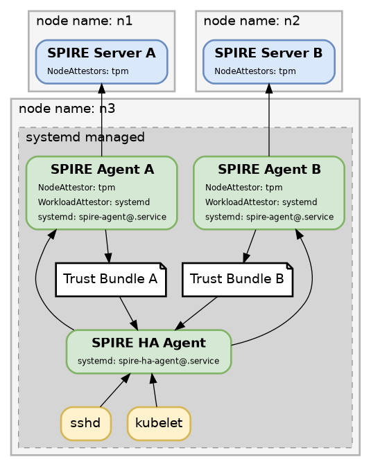
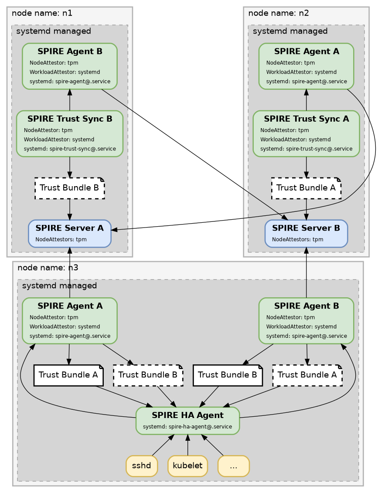

# SPIRE HA Agent

[](https://opensource.org/licenses/Apache-2.0)
[](https://github.com/spiffe/spiffe/blob/main/MATURITY.md#development)

An agent to setup a SPIRE HA TrustDomain using two independent SPIRE Servers

## Warning

This code is very early in development and is very experimental. Please do not use it in production yet. Please do consider testing it out, provide feedback,
and maybe provide fixes.

## How it Works

If the trust bundles of both servers are presented to the workload, it will not care which server instance a certificate is issued from. This agent provides
both trust bundles to the end user as one trust bundle, and will contact whichever server is responding to respond to x509 certificate or JWT token requests.

# Basic Setup

## Simple Diagram



# Advanced setup

While the basic setup allows a server to go down and workloads to continue to operate normally, it has a drawback. It requires both servers to be up during spire-ha-agent startup. This restriction can be eliminated by making the trust bundle of the other server available. The spire-trust-sync service can be used to do so.

# Modes

The agent supports two upstream API modes, selected with the `-mode` flag:

- `-mode=delegated` (default): uses the SPIRE Delegated Identity API over each agent's private admin socket. This is the original behavior.
- `-mode=broker`: uses the experimental SPIFFE Broker API. The connection is authenticated with mTLS using an X509-SVID the spire-ha-agent obtains from each SPIRE agent's Workload API, and trust bundles (including federated bundles) are delivered inline in the broker responses. Unlike delegated mode, broker mode supports federation: a workload's federated trust domains are served to it as federated bundles (see below for exactly what gets unioned).

### Which trust bundles are unioned

Only the **local (HA) trust domain** is combined across the two servers. Its bundle is served as the union of side A's authorities, side B's authorities, and both sides' `spire-ha` cross-trust authorities, which is what lets a workload holding an SVID minted by one server validate a peer minted by the other. `spire-ha` itself is never exposed as a trust domain of its own.

**Federated** trust domains are passed through from the caller's own upstream response and are not combined with the spire-ha-agent's own view of them. Each workload's `federates_with` list is configured on its own registration entry in SPIRE, and for federation to be highly available both servers are expected to carry the same federation configuration — so whichever server answered a given request already holds the right bundle. (The bundle-only calls, `FetchX509Bundles` and `FetchJWTBundles`, do combine a federated domain across the two responses the caller itself received, since both servers answer those requests; with matching federation config on both sides the result is the same either way.)

A workload is only ever told about trust domains its own registration entry entitles it to; the spire-ha-agent's own federation configuration never adds trust domains to a workload's response.

## Broker mode configuration

Broker mode is configured with environment variables and/or a YAML config file passed via `-config <path>`. Precedence: an option explicitly present in the config file wins; when absent from the file, the environment variable wins; otherwise the default applies. The config file is only supported in broker mode.

| Config file field | Environment variable | Meaning | Default |
| --- | --- | --- | --- |
| `single` | `SPIRE_HA_AGENT_SINGLE` (=`enabled`) | Single-upstream mode | false |
| `socket` | `SPIRE_HA_AGENT_SOCK` | Downstream Workload API unix socket | `/var/run/spire/agent/sockets/main/public/api.sock` |
| `vsock.enabled` / `vsock.port` | `SPIRE_HA_AGENT_VSOCK` (=`enabled`) / `SPIRE_HA_AGENT_PORT` | Serve the Workload API on VSOCK instead | disabled / 997 |
| `upstream_a.broker_address` | `SPIRE_HA_AGENT_BROKER_A` (single mode: `SPIRE_HA_AGENT_BROKER`) | Upstream Broker API endpoint A (`unix://` or `tcp://`) | `unix:///var/run/spire/agent/sockets/a/broker/broker.sock` |
| `upstream_a.workload_socket` | `SPIRE_HA_AGENT_WORKLOAD_SOCKET_A` (single mode: `SPIRE_HA_AGENT_WORKLOAD_SOCKET`) | Workload API socket the spire-ha-agent obtains its own client SVID from, side A | `unix:///var/run/spire/agent/sockets/a/public/api.sock` |
| `upstream_b.*` | `SPIRE_HA_AGENT_BROKER_B` / `SPIRE_HA_AGENT_WORKLOAD_SOCKET_B` | Same for side B (ignored in single mode) | `.../b/...` variants |
| `broker_endpoint` | (config file only) | Downstream Broker API endpoint, see below | disabled |
| `metrics.bind_address` | (config file only) | Prometheus `/metrics` listen address; block absent disables it | disabled |
| `upstream_keepalive.time` / `.timeout` | (config file only) | gRPC keepalive on the upstream broker connections; `time: 0` disables | `5m` / `20s` |

Broker mode requirements:

- The spire-ha-agent process must have its own registration entry on each server, which provides its client SVID. That entry must federate with `spire-ha` so the agent can build the unioned local trust domain bundle. It does not need to federate with the domains its *workloads* federate with — its `federates_with` list does not affect what workloads are served. (It does still need to federate with the trust domain of any cross-trust-domain client of the downstream broker endpoint, since that is what verifies those clients' certificates.)
- The connection to each upstream broker is mTLS, and the server's certificate is verified against that side's trust bundle. Its SPIFFE ID is not pinned: the SPIRE agent's broker endpoint presents the agent's own SVID, whose ID is not predictable from configuration.

## Observing upstream health

Broker mode tracks each upstream side's liveness from its two global bundle subscriptions, which is the closest available equivalent to delegated mode's debug-API polling — the Broker API has no health RPC, and SPIRE's debug API is admin-socket only.

Transitions are logged as they happen (`brokerB: x509 bundle subscription down: ...`), a summary line is logged every 30s, and if a `metrics` block is configured the same state is exported:

| Metric | Labels | Meaning |
| --- | --- | --- |
| `spire_ha_agent_upstream_up` | `side` (`a`/`b`), `stream` (`x509`/`jwt`) | 1 while that global bundle subscription is established |
| `spire_ha_agent_upstream_side_up` | `side` | 1 while all of that side's subscriptions are established — alert on `== 0` |

**"Up" means the subscription is currently established, not that data arrived recently.** The upstream only pushes when bundles change, so a perfectly healthy side can be silent for hours; treating silence as failure would be wrong.

Process death, socket close, connection reset and RPC errors surface immediately as stream errors. A *wedged* connection (silently dropped TCP) is caught by gRPC keepalive instead. The keepalive default is 5 minutes because that is the fastest a stock server permits: gRPC servers that set no keepalive enforcement policy answer more frequent pings with GOAWAY `too_many_pings` and drop the connection, and SPIRE's broker endpoint sets no policy. This applies to unix sockets too — it is HTTP/2 ping handling, not a TCP behaviour — though on a unix socket a dead peer gives an immediate EOF anyway, so the interval only matters for `tcp://` upstreams. Lower `upstream_keepalive.time` only once SPIRE allows the enforcement policy to be configured; the agent logs a warning if you set it below 5 minutes.

## Downstream Broker API endpoint

In broker mode the spire-ha-agent can optionally serve the complete SPIFFE Broker API itself, delivering the same view as its Workload API (see "Which trust bundles are unioned" above), keyed by trust domain SPIFFE ID as the Broker API requires. It is enabled by adding a `broker_endpoint` block to the config file, modeled after the SPIRE agent's own broker endpoint configuration:

```yaml
socket: /var/run/spire/agent/sockets/main/public/api.sock
upstream_a:
  broker_address: unix:///var/run/spire/agent/sockets/a/broker/broker.sock
  workload_socket: unix:///var/run/spire/agent/sockets/a/public/api.sock
upstream_b:
  broker_address: unix:///var/run/spire/agent/sockets/b/broker/broker.sock
  workload_socket: unix:///var/run/spire/agent/sockets/b/public/api.sock
broker_endpoint:
  # at least one of socket_path / bind_address is required; both may be set
  socket_path: /var/run/spire/agent/sockets/main/broker/broker.sock
  bind_address: "0.0.0.0:8443"
  brokers:
    - id: spiffe://example.org/my-broker
      allowed_reference_types:
        - type_url: type.googleapis.com/spiffe.broker.WorkloadPIDReference
          # PID references are node-local; only allow them over TCP if you
          # know what you are doing
          allow_over_tcp: false
    - id: spiffe://other.org/remote-broker
      allowed_reference_types:
        - type_url: "*"
          allow_over_tcp: true
```

Semantics (mirroring the SPIRE agent's broker endpoint):

- The endpoint requires mTLS. The server certificate is the spire-ha-agent's own SVID — whichever of the two upstream-issued SVIDs currently has the longest remaining validity, so it may alternate between sides; a certificate from either side validates against the merged trust bundle.
- Clients are authenticated at the TLS layer: only SPIFFE IDs listed in `brokers[].id` can connect (exact match). Cross-trust-domain client IDs are supported when that trust domain is federated with the spire-ha-agent's entry. Client certificates are verified against the merged bundle state.
- Every request must carry the gRPC metadata `broker.spiffe.io: true` or it is rejected with `InvalidArgument`.
- Each broker's `allowed_reference_types` restricts which workload reference types it may use (verbatim protobuf type URLs, `"*"` for any). A reference type is denied over TCP unless `allow_over_tcp: true`; unix socket connections are always allowed.
- `socket_path` must not share a directory with the Workload API socket.

Trust model: the spire-ha-agent does not attest workloads. References are forwarded verbatim to the upstream SPIRE agents' Broker APIs, which resolve and attest them on this node. An allowlisted broker can therefore request SVIDs for any reference its `allowed_reference_types` permits (e.g. any PID on the node) — brokers must be trusted to assert references honestly, exactly as with the SPIRE agent's own broker endpoint.

## Cross Linked Trust Diagram



